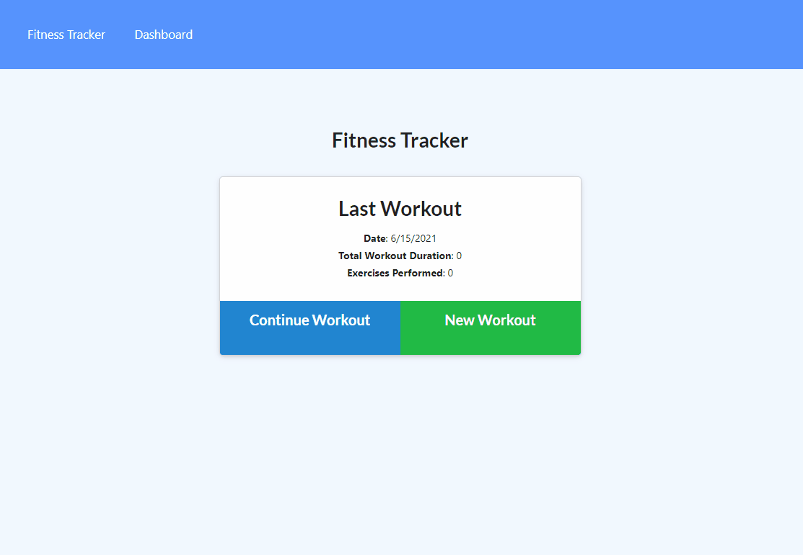

# fitness-tracker

## Description

This is a basic fitness tracker that will help track the amount of weight, time, and distance of your workouts over a 7 day period. This was my first time using Mongoose and MongoDB and I felt like it was pretty intuitive. This is a basic but helpful application that I will be able to use in my day to day life.

## Table of Contents (Optional)

- [Usage](#usage)
- [Credits](#credits)
- [License](#license)

## Usage

To use the app simply visit: https://immense-castle-10334.herokuapp.com/?id=60c7d55c7a7b600015fa39c1

## Credits

#### Collaborators

- Nick Strong
- Sam Roberson
- Chip Long
- Jon Gregory

#### Technology Used

- NodeJs
- ExpressJS
- Mongoose
- Morgan
- MongoDB
- Heroku

## License

MIT License

Copyright (c) [2021] [TJ Courey]

Permission is hereby granted, free of charge, to any person obtaining a copy
of this software and associated documentation files (the "Software"), to deal
in the Software without restriction, including without limitation the rights
to use, copy, modify, merge, publish, distribute, sublicense, and/or sell
copies of the Software, and to permit persons to whom the Software is
furnished to do so, subject to the following conditions:

The above copyright notice and this permission notice shall be included in all
copies or substantial portions of the Software.

THE SOFTWARE IS PROVIDED "AS IS", WITHOUT WARRANTY OF ANY KIND, EXPRESS OR
IMPLIED, INCLUDING BUT NOT LIMITED TO THE WARRANTIES OF MERCHANTABILITY,
FITNESS FOR A PARTICULAR PURPOSE AND NONINFRINGEMENT. IN NO EVENT SHALL THE
AUTHORS OR COPYRIGHT HOLDERS BE LIABLE FOR ANY CLAIM, DAMAGES OR OTHER
LIABILITY, WHETHER IN AN ACTION OF CONTRACT, TORT OR OTHERWISE, ARISING FROM,
OUT OF OR IN CONNECTION WITH THE SOFTWARE OR THE USE OR OTHER DEALINGS IN THE
SOFTWARE.

## Features

- Track both Cardio and Resistance Workouts
- Graphs for the past weeks workouts
- Ability to store info on weight, reps, sets, time, and distance

## How to Contribute

No contribution necessary but feedback is always appreciated. Feel free to message me here or via email at tjcourey84@gmail.com
